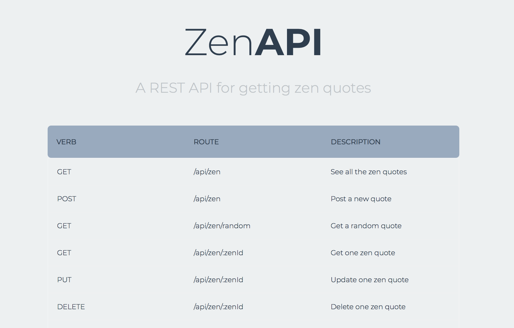
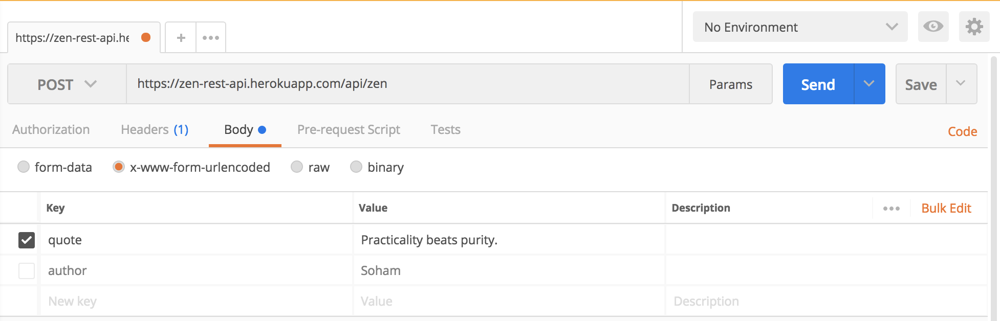
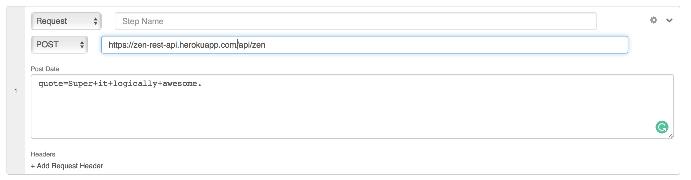

# Zen-API

A REST API created with endpoints to fetch and post Zen quotes.  
Link: https://zen-rest-api.herokuapp.com    

## Methods for Using the REST API

### GET a Random Quote
Simply visit the `/api/zen/random` route to see a random quote  
Link : https://zen-rest-api.herokuapp.com/api/zen/random

### GET all zen quotes

The request has to be sent to the `/api/zen` route to obtain a JSON list of all the quotes

### POST a new zen quote

Send the request to `/api/zen` with the following body request parameters
1) quote: String
2) author: String (optional)

The Post request can be sent in one of the following ways

1) POSTMan (https://www.getpostman.com)

2) API Tester (https://apitester.com)

### GET one quote
Send request to `/api/zen/:zenId` where the ZenId is the ID of the zen quote

### PUT one quote
Send the PUT request to `/api/zen/:zenId` to update the zen

### DELETE one quote
Send the DELETE request to `/api/zen/:zenId` to delete one zen quote. Please do not delete lot of quotes
